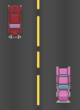

# Smart Car
This project was created by Landen Love, Nguyen Vuong, and Hoang Bui at Augustana College. This project was created for the Software Development course CSC-305.


# How to download
## Windows
Download from the [Releases](https://github.com/QCgeneral29/Smart-Car/releases) page. Extract zip contents and open run.bat.

## Mac
```
git clone https://github.com/QCgeneral29/Smart-Car
```
Import project into eclipse and add the following VM arguments to run configuration
```
--module-path "javafx-sdk-11.0.2-mac/lib" --add-modules javafx.controls,javafx.media,javafx.base,javafx.graphics,javafx.swing
```

(You might have to add the javafx libraries to your build path)

## Linux
```
git clone https://github.com/QCgeneral29/Smart-Car
```
Import project into eclipse and add the following VM arguments to run configuration
```
--module-path "javafx-sdk-11.0.2-linux/lib" --add-modules javafx.controls,javafx.media,javafx.base,javafx.graphics,javafx.swing
```

(You might have to add the javafx libraries to your build path)

# How to play
The longer your car stays alive, the more points you gain. In order to survive, you must stay on the road and avoid other motorists. You are also being chanced by a malicious hacker that wants to run you off the road!

## The player
### This is your car, make sure you drive safe! 


### This is the evil hacker that wants to take control of your vehicle. Avoid bumping into him! 


### There are other motorists on the highway. Avoid bumping into them and taking damage!


### Collect toolboxes to repair your car.
